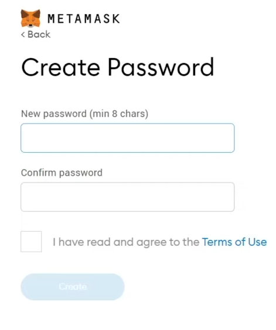

# RDF Dataset verification using Linkchain, Ethereum and Solid
 
 Contents
 --------
 
*   [Overview](#overview)
*   [Linkchain RDF Verification](#linkchain-rdf-verification)
*   *   [Main Linkchain Library Functions](#main-linkchain-library-functions)
    *   [MerQLAnchor Smart Contract](#merqlanchor-smart-contract)
*   [MetaMask and the Ethereum Testnets](#metamask-and-the-ethereum-testnets)
      *   [Installing MetaMask](#installing-metamask)
      *   [Working with MetaMask](#working-with-metamask)
 
*   [Solid and the Inrupt API](#solid-and-the-inrupt-api)
      *   [Creating an Inrupt Solid Pod](#creating-an-inrupt-solid-pod)
      *   [Working with the Inrupt API](#working-with-the-inrupt-api) 
*   [Stepping Through the Demo](#stepping-through-the-demo)
*   [Useful Resources](#useful-resources)
 
* * *
 
## Overview
 
To assist you in your aims at the summer school, we have written a demonstrator that shows a collection of software, working together to create a client-side application that can validate RDF datasets on the blockchain using the Linkchain library.  
Here is the overall architecture of the elements in the demo:  
  
We will now go through each of these elements in turn.

* * *

## Linkchain RDF Verification

The Linkchain library supports the use of Merkle trees to provide blockchain-based verification of RDF quads, both at an all-in-one and per-quad level. By verification, we mean that once a set of RDF quads has been 'anchored' to a blockchain, a verifier can determine whether a given set of quads is identical to the anhored set, or not.

From the end user point of view, there are two types of data: the RDF itself, and the metadata needed to perform verification. The metadata itself comes in two forms: a compact form representing the full set of Merkle trees associated with a given set of RDF quads, and a much more verbose 'granular' form which associates each individual quad with a Merkle proof and the metadata needed to associate each proof with an immutable blockchain record. The first form of metadata can be used to verify, as a simple yes or no, whether a provided set of quads is identical up to blank node renaming to the set used to generate and anchor that metadata. The second form (which can be (re)generated at any time from the original set of quads and the first form) allows partial verification and sharing. That is, given a set of quads and a (sub)set of granular metadata, it is possible to identify exactly which quads in that set do or don't correspond to the originally anchored set.

The functions of the library correspond to four different steps of processing, given a set of 'quads'.

1. Generate verification metadata for 'quads' (not associated with any blockchain record)
2. Anchor verification metadata to a blockchain (adds relevant anchor details to step 1 result)
3. Generate granular verification metadata for 'quads' (repackages step 2 result for per-quad processing)
4. Verify any given set of quads against the given metadata (returns arrays of verified/unverified quads)

Only the outputs of steps 2 and 3 can be used to verify in step 4 - verification requires the anchoring metadata. Either format of metadata may be passed in to step 4.

Steps 2 and 4 require writing to, and reading from, respectively, a blockchain. Because methods for talking to different blockchains vary, as do methods for talking to the same blockchain from different environments (e.g., browser JS vs. server node.js), the corresponding library functions each take a callback function to handle the actual writing/reading, as appropriate. The library parses and handles the inputs and results as needed. 
 
### Main Linkchain Library functions

```
getVerificationMetadata: async function (quads, options)
```
Accepts 'quads' in JSON-LD, or N-Triples/N-Quads/N3/Turtle, and 'options' ({} for defaults).
Returns unanchored Linkchain MerQL verification metadata.

Code snippet example:
```
try {
  quadsFinal = <the rdf to get verification metadata for>

  if (quadsFinal != "" && quadsFinal != null) {
    let options = {}
    metadata = await linkchains.getVerificationMetadata(quadsFinal, options);
  } else {
    alert("Please select a file of RDF first");
  }
} catch (e) {
  console.log(e);
}

```

* * *
```
anchorMetadata: async function (metadata, options, anchorFunction)
```

Accepts unanchored metadata 'metadata' (e.g., output of getVerification Metadata), options 'options', and a callback 'anchorFunction'.
Returns anchored Linkchain MerQL verification metadata.

anchorFunction takes care of actual blockchain writing based on options (contents of options vary with implementation of anchorFunction)

Code snippet example for anchoring with a MerQL Anchor Contract:
```
let options = {} // requires no additional options as it is using the default Linkchain MerQL Contract way of anchoring
let dataToAnchor = <the rdf code that was anchored>;
const anchoredMetadata = await linkchains.anchorMetadata(dataToAnchor, options, deployMerQLAnchorContract);

```

* * *
```
getGranularVerificationMetadata: async function (quads, metadata)
```
Accepts 'quads' and anchored metadata 'metadata' (e.g., output of anchorMetadata).
Returns anchored granular Linkchain MerQL metadata suitable for per-quad verification.

'quads' may be any of the RDF formats accepted by getVerificationMetadata.

This function will not work if passed unanchored metadata.

Code snippet example:
```
const rdfInputData = <the rdf code that was acnhored>
const anchoredMetadata = <data returned from linkchains.anchorMetadata>

const granularMetaData = await linkchains.getGranularVerificationMetadata(rdfInputData, anchoredMetadata);
```

* * *
```
verify: async function (quads, metadata, options, retrieveAnchor)
```

Accepts 'quads', anchored metadata 'metadata' (granular or otherwise), 'options', and a callback 'retrieveAnchor'.
Returns an object

```
{
  'verified': [...],
  'unverified': [...]
}
```
containing N-Quad string representations of the verified/unverified quads in 'quads', as appropriate. If 'metadata' is not granular, then one of verified or unverified will be empty, depending on whether the verification failed or succeeded, respectively

Code snippet example:
```
const rdfInputData = <the rdf code that was anchored>
const anchoredMetadata = <the data returned from a call to linkchains.anchorMetadata>
const granularMetaData = <the data returned from a call to linkchains.granularMetaData>

const handler = async function(anchor, options) {
  let reply = "";
  if (anchor.type == "ETHMerQL") {
    reply = await readMerQLAnchorContract(anchor, options);
  }
  console.log(reply);

  return reply;
}

let options = {}
const output = await linkchains.verify(rdfInputData, granularMetaData, options, handler);


const rdfInputData = <the rdf code that was anchored>
const anchoredMetadata = <the data returned from a call to linkchains.anchorMetadata>
let options = {}

const handler = async function(anchor, options) {
  // check if merkle or blockchain verification
  let reply = "";
  if (anchor.type == "ETHMerQL") {
    reply = await readMerQLAnchorContract(anchor, options);
  } else if (anchor.type == "RDFTokens") {
    reply = await readTokenMetadata(anchor, options);
  }

  return reply;
}

const output = await linkchains.verify(rdfInputData, anchoredMetaData, options, handler);

```

### MerQLAnchor Smart Contract
```
pragma solidity ^0.5.7;

contract MerQLAnchor {
    string public targetHash;
    uint256 public creationTime;
    address public owner;
    string public indexType; // Defines how data was split: uniform = data split based on LSD and divisor, subject = based on hash of subject term, object = based on hash of object term, predicate = based on hash of predicate term, graph = based on hash of graph term, subjectobject = based on hash of subject & object term
    uint256 public leastSignificantDigits;
    string public divisor;
    string public quadHashFunction;
    string public treeHashFunction;
    string public indexHashFunction;

    constructor(
        string memory hashIn,
        string memory newIndexType,
        uint256 lsds,
        string memory div,
        string memory quadHashFunctionIn,
        string memory treeHashFunctionIn,
        string memory indexHashFunctionIn
    ) public {
        owner = msg.sender;
        targetHash = hashIn;
        creationTime = block.timestamp;
        leastSignificantDigits = lsds;
        divisor = div;
        indexType = newIndexType;
		quadHashFunction = quadHashFunctionIn;
		treeHashFunction = treeHashFunctionIn;
		indexHashFunction = indexHashFunctionIn;
    }

    function getData()
        public
        view
        returns (
            uint256 theCreationTime,
            address theOwner,
            string memory thetargetHash,
            string memory theIndexType,
            uint256 leastSignificants,
            string memory theDivisor,
        	string memory theQuadHashFunction,
        	string memory theTreeHashFunction,
        	string memory theIndexHashFunction
        )
    {
        theCreationTime = creationTime;
        theOwner = owner;
        thetargetHash = targetHash;
        theIndexType = indexType;
        leastSignificants = leastSignificantDigits;
        theDivisor = divisor;
		theQuadHashFunction = quadHashFunction;
		theTreeHashFunction = treeHashFunction;
		theIndexHashFunction = indexHashFunction;
    }
}
```

* * *

## Metamask and the Ethereum Testnets

MetaMask (https://metamask.io/) is a free web and mobile crypto wallet that allows users to store and swap cryptocurrencies, interact with the Ethereum blockchain ecosystem, and host a growing array of decentralized applications (dApps)

### Installing MetaMask

You will need to install Metamask in your browser to interact with our demo and any experiments of your own that you undertake.  
It is currently available as a plugin for Chrome, Firefox, Edge and Brave: [https://metamask.io/download/](https://metamask.io/download/).  
  
Once installed in your browser you should see a fox head icon appear in your browser bar.  
  
Here is an example of what it looks like in FireFox:  
  
  
  
Click the icon to open the MetaMask app. You should see something similar to this:  
  
  
  
Click **'Get Started'**, and this will open a page simiar to this:  
  
  
  
Click **'Create a wallet'** button on the right to get started with a new wallet. Then, the system will ask you whether or not you want to share analytics with MetaMask. This decision is entirely up to you:
  
  

After that, you’ll be prompted to create a password:  

 

This is your password for access to your wallet on your local device. As with all online accounts, you should ensure that you are using a strong password. 
On the next page, you’ll be given a set of 12 words that act as your private key. Please keep this safe.

 

Once you have created your wallet, you need to turn on seeing Ethereum Testnets as they are off by default. 
Click the coloured ball on the top right of the screen to show your accounts area.

  

Then select 'Settings'

  

Then select 'Advanced'. Scroll down until you see 'Show Test Networks' and toggle that on.

  

Then close this window and return to the main screen. If you select the network dropdown at the top, you should now see the test networks you can select from.

  

For our demo, we have used the Sepolia Tesnet. But you can use any testnet. 
For each of testnet you wish to use, you will need to go to an available faucet where you can aquire some test eth. 
This will allow you to write data to that ethereum testnet blockchain.

  
If you Google Ethereum testnet faucets, there are many options.
Here are a few options to get you started:

If you have or create an Infura Account you can use:
* https://www.infura.io/faucet/sepolia
* https://www.infura.io/faucet/linea

If you have or create an Alchemy Account you can use:
* https://sepoliafaucet.com/
* https://goerlifaucet.com/

If you have or create a Twitter Account you can use:
* https://faucet-sepolia.rockx.com/
* https://faucet.paradigm.xyz/

Before interacting with our demo, please select the testnet you want to use in your MetaMask Wallet and make sure you have some eth on that network.  

  

 

### Working with MetaMask

To interact with the blockchain through Metamask, we use the ethers.js library by including the following script in our webpage: 'https://cdn.ethers.io/lib/ethers-5.2.umd.min.js'.

Before you can connect to MetaMask to talk to the blockchain, you must have logged into MetaMask in your browser. In our demonstrator, in the first tab, you will see a button called 'Connect To MetaMask'. This button will only be available if you have not already logged into MetaMask in your current browser session. Clicking this will launch the MetaMask app and you will be asked to login and permission the website to interact with it.  
  
See the function _'loginToMetaMask'_ in _'app.js'_ in our demo source code for full details.  
  
From their documentation, you connect to Metamask, in the following way:

// A Web3Provider wraps a standard Web3 provider, which is
// what MetaMask injects as window.ethereum into each page
const provider = new ethers.providers.Web3Provider(window.ethereum)

// The MetaMask plugin also allows signing transactions to
// send ether and pay to change state within the blockchain.
// For this, you need the account signer...
const signer = provider.getSigner()		
		

In our _'loginToMetaMask'_ function we use the following to prompt MetaMask:  
  

// MetaMask requires requesting permission to connect users accounts
await provider.send("eth\_requestAccounts", \[\]);
		

For full details, their documentation can be found here: [https://docs.ethers.io/v5/](https://docs.ethers.io/v5/)  
  
* * *

## Solid and the Inrupt API

Solid is a technology for organizing data, applications, and identities on the web. Solid enables richer choices for people, organizations and app developers by building on existing web standards. More information can be read here: https://inrupt.com/solid/

### Creating an Inrupt Solid Pod

Our demonstrator uses Solid as a file store. In order to store and retreive files in the demo, you will first need to create yourself an inrupt.com solid pod. Sign up for an Inrupt Solid Pod here: [https://signup.pod.inrupt.com/](https://signup.pod.inrupt.com/)  
  
For more information on using your Solid pod from the Inrupt podbrowser interface, please see their documentation: [https://docs.inrupt.com/user-interface/podbrowser/](https://docs.inrupt.com/user-interface/podbrowser/)  

### Working with the Inrupt API

We have created a separate Inrupt library, ([https://github.com/KMiOpenBlockchain/isws-inrupt](https://github.com/KMiOpenBlockchain/isws-inrupt)), that our demo uses to call Solid and read and write files. Please see the source code and speparate read me on using this library.

Useful Documents:
[https://inrupt.com/products/dev-tools](https://inrupt.com/products/dev-tools)  
[https://docs.inrupt.com/developer-tools/javascript/client-libraries/](https://docs.inrupt.com/developer-tools/javascript/client-libraries/)

* * *

## Stepping Through the Demo

[](https://blockchain7.kmi.open.ac.uk/movies/movies/isws-movie-2023.mp4)

* * *

## Useful Resources:


Faucets

If you have or create an Infura Account you can use:
* https://www.infura.io/faucet/sepolia
* https://www.infura.io/faucet/linea

If you have or create an Alchemy Account you can use:
* https://sepoliafaucet.com/
* https://goerlifaucet.com/

If you have or create a Twitter Account you can use:
* https://faucet-sepolia.rockx.com/
* https://faucet.paradigm.xyz/

If you have a Google account you can use:
* https://cloud.google.com/application/web3/faucet/ethereum/sepolia

Other Useful Links

*   [MetaMask Developer Documentation](https://docs.metamask.io/guide/)
*   [Etheres.js documentation](https://docs.ethers.io/v5/)
*   [About Solid](https://inrupt.com/solid/)
*   [Sign Up To Solid](https://signup.pod.inrupt.com/)
*   [Solid Pod Browser Documentation](https://docs.inrupt.com/user-interface/podbrowser/)
*   [Inrupt Solid developer tools](https://inrupt.com/products/dev-tools)
*   [Inrupt Libraries](https://docs.inrupt.com/developer-tools/javascript/client-libraries/)

* * *
